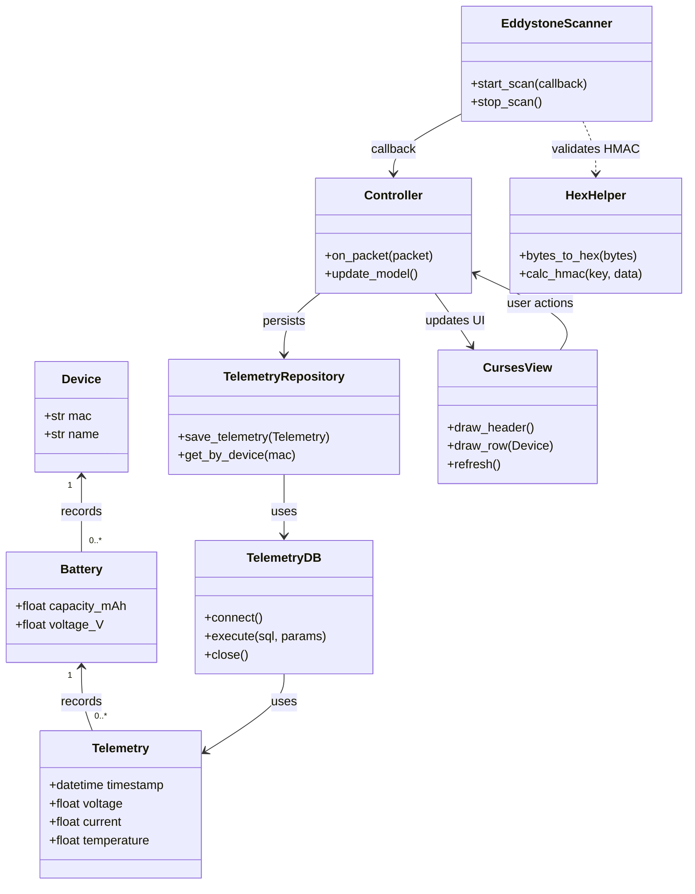

## esp32_smart_battery_analyzer

This device is designed for testing Lithium Battery. It is powered by ESP32 chip that controls four mode of operation: 

1. Charge Mode, 
2. Discharge Mode, 
3. Analyze Mode, 
4. IR Test Mode

This repository is fully featured with schematics (gerber files), bill of materials, stl for 3-D printing, source code for live UI, plotting and retention of battery profiles.

The source code can manage a fleet of those devices analyzing batteries in parallel

### Bluetooth fleet of Smart‑Charger and Battery‑Profile Analyzer

A lightweight, asyncio‑driven Python application that:

- Scans BLE (Eddystone‑TLM) advertisements from ESP32‑based Smart‑Chargers.
- Stores telemetry in a local SQLite database.
- Shows live, curses‑based tables on the terminal.
- Provides a set of scripts to plot historic charge/discharge curves.
- The project follows a tiny MVC pattern (Model ↔ View ↔ Controller) and is deliberately kept dependency‑free apart from Bleak (the BLE stack).

### 🎯 Features at a glance

| Feature	| Description |
| -	| - |
| **BLE scanner** | asynchronous, runs on any Linux host (Pi, laptop, VM).	|
| **Curses UI** | pure‑ASCII, works on head‑less devices.	|
| **SQLite persistence** | simple DAO layer, easy to export data.	|
| **Live plotting** | Matplotlib scripts for single‑ or multi‑battery views.	|
| **Modular architecture** | scanner, repository, UI, and utilities are isolated.	|
| **Extensible** | add new telemetry fields or UI panels with minimum touching of the DB layer.	|

### 📂 Repository layout

```
esp32_smart_battery_analyzer/
│
├─ datasheet_schematics/   # PDFs of schematics & datasheets
├─ gerber/                 # Gerber files for PCB production
├─ stl/                    # 3D‑printable housing & button models
├─ bom/                    # Bill‑of‑Materials (components, parts number)
└─ sources/                # Python source code
   │
   ├─ main.py                  # Bootstrap / async event‑loop starter
   ├─ app_logger.py            # Centralised logging helper
   ├─ controller.py            # MVC controller (model ↔ view glue)
   ├─ curses_view.py           # Curses‑based UI implementation
   ├─ eddystone_scanner.py     # BLE scanner → controller callback
   ├─ hex_helper.py            # HMAC, hex utilities & byte helpers
   ├─ models.py                # Dataclasses: Device, Battery, Telemetry
   ├─ telemetry_db.py          # Low‑level SQLite wrapper (DAO)
   ├─ telemetry_repository.py  # Repository façade (business‑logic service)
   ├─ archive_sqlite.py        # Merge many DBs into a master.db
   ├─ timing_decorator.py      # Simple profiling decorator
   │
   ├─ telemetry_live_plot.py   # Plot a single battery profile live
   ├─ multi_live_plot.py       # Plot several profiles side‑by‑side live
   ├─ overlay_battery_plot.py  # Overlay multiple profiles on one chart
   ├─ ... (other helper scripts)
   └─ Smart_Multipurpose_Battery_Tester
       │
       └─ Smart_Multipurpose_Battery_Tester.ino     # ESP32 sketch (e.g arduino)
```

## 🚀 Getting started

### Prerequisites

- Python ≥ 3.8
- pip (pyenv or a virtual‑env manager of your choice is recommended)
- A Linux host with BLE support (Raspberry Pi, Ubuntu, Debian, …)

### Installation

```bash
# 1️⃣ Clone the repo
git clone https://github.com/aakloul/esp32_smart_battery_analyzer.git
cd esp32_smart_battery_analyzer

# 2️⃣ (Optional) create a virtual environment
python -m venv .venv
source .venv/bin/activate   # on Windows: .venv\Scripts\activate

# 3️⃣ Install dependencies
pip install -r requirements.txt

# 4️⃣ Run the application
python sources/main.py
```

### Plotting utilities

```python
# Plot a set of historic profiles (master.db must exist)
python sources/overlay_battery_plot.py --db ~/battery_profiles/master.db --batteries 2 3 4 5 6

# Live plot of a single battery while the charger runs
python sources/telemetry_live_plot.py

# Compare several batteries side‑by‑side in real time
python sources/multi_live_plot.py``
```


### 🏗️ Architecture Overview

#### Layered responsibilities

| Layer	| Responsibility	| Example class |
| - | - | - |
| Presentation / Runtime |	Starts the async loop, hands callbacks to Bleak	| main.py |
| Domain / Business Logic |	Decodes BLE packets, decides what to store	| EddystoneScanner |
| Application Service	| Coordinates persistence, hides DB details	| TelemetryRepository |
| Infrastructure / Persistence |	Raw SQLite commands, schema creation	| TelemetryDB |
| Utility	| Hex formatting & HMAC verification	| HexHelper |

#### Mermaid class diagram


The diagram shows the main data classes (Device, Battery, Telemetry) and how the scanner, controller, repository, DB wrapper and UI interact.

#### Principles

The codebase **testable, maintainable, and future‑proof with clear separation**: 
- The scanner never touches SQL; 
- the repository never knows about BLE.
- The UI lives in its own module and the whole application follows a very lightweight MVC pattern (Model = dataclasses + SQLite, View = curses based terminal table, Controller = glue that updates the model and tells the view to redraw).

**Lightweight**: All modules import only the Python standard library plus bleak (already required for BLE). No extra third‑party UI frameworks are needed, keeping the package lightweight and easy to install.

**Requires minimum hardware specifications**, all the UI is ASCII based to allow the capture to run on a headless device (e.g raspberry pi)

**Responsiveness** of the UI and scanning with asyncio and threading

## 🛠️ Development & Contribution

1. Code style – run black . and flake8 before committing.

2. Testing – add unit tests under a tests/ directory (pytest recommended).

3. Profiling UI loops – use the built‑in cProfile wrapper:

```python -m cProfile -o profile.pstats main.py```

After you quit the program, inspect the hot spots:

```python
python - <<'PY'
import pstats, sys
p = pstats.Stats('profile.pstats')
p.strip_dirs().sort_stats('cumtime').print_stats(20)
PY
```
Look for functions that consume a lot of cumulative time (_draw_table, _draw_log, parse_advertisement, etc.). Those are the places to optimise.

4. Pull requests – fork the repo, push your branch, and open a PR. Include a short description of the change and reference any related issue.

## References: 

| Link | |
| - | - |
| [Instructables](https://www.instructables.com/DIY-Smart-Multipurpose-Battery-Tester/) | detailed instructions and schematics |
| [Youtube](https://youtu.be/QN8AuUfg2y8?si=btL3awTXZG-g8NH7) | |
| [PCBWay](https://www.pcbway.com/project/shareproject/DIY_Smart_Multipurpose_Battery_Tester_aaf0922e.html) | PCB production |
| [Seed Studio](https://wiki.seeedstudio.com/XIAO_ESP32C3_Getting_Started/) | Getting Started with ESP32-C3 |
| [Nimble on ESP32-C](https://wiki.seeedstudio.com/XIAO_ESP32C3_Bluetooth_Usage/) | Bluetooth with ESP32-C3 |
| [Nimble-Arduino](https://github.com/h2zero/NimBLE-Arduino/blob/master/examples/BLE_EddystoneTLM_Beacon/BLE_EddystoneTLM_Beacon.ino) | Nimble Eddystone-TLM Beacons |
| [HMAC](https://www.dfrobot.com/blog-921.html?srsltid=AfmBOootriPzmv8BGEABjtGPIYKFY8ldHPTuY8WLx7NJhZGtg5EIOsAH) | HMAC implementation for esp32 chip |

## 📄 License
The code is released under the GPLv3 License – see the LICENSE file for details.

## 🙋‍♀️ Need help?

- Open an issue on GitHub.
- Join the discussion in the Discussions tab for design ideas.
- For quick questions, drop a comment on the relevant PR or issue.

Happy hacking! 🚀
